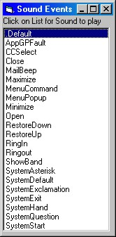



## Window Sound Events

### Description

Play Windows Sound Events In One Line.

Minimize, Maximize, Restore up, Restore down, Menu Commands...
 
### More Info
 

             |
---                |---
**Submitted On**   |2003-06-06 06:46:06
**By**             |[Toni](https://github.com/Planet-Source-Code/PSCIndex/blob/master/ByAuthor/toni.md)
**Level**          |Beginner
**User Rating**    |4.5 (18 globes from 4 users)
**Compatibility**  |VB 4\.0 \(32\-bit\), VB 5\.0, VB 6\.0, VB Script, VBA MS Access, VBA MS Excel
**Category**       |[Windows System Services](https://github.com/Planet-Source-Code/PSCIndex/blob/master/ByCategory/windows-system-services__1-35.md)
**World**          |[Visual Basic](https://github.com/Planet-Source-Code/PSCIndex/blob/master/ByWorld/visual-basic.md)
**Archive File**   |[Window\_Sou159764662003\.zip](https://github.com/Planet-Source-Code/toni-window-sound-events__1-46007/archive/master.zip)

